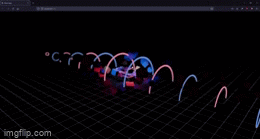

# ThreeJS-react

ThreeJS-react is a project that renders a cene in 3D using react and Three.

### /etc

- Depth of field
- Field of view
- Bloom
- Render a 3D Model
- Renders and cast light
- Also create cubes and circles without a model

## Libs

- Three
- Fiber
- react-three
